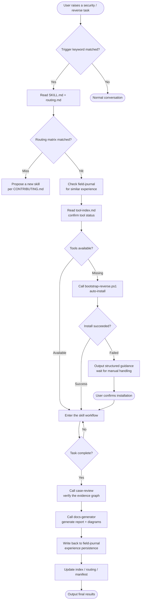
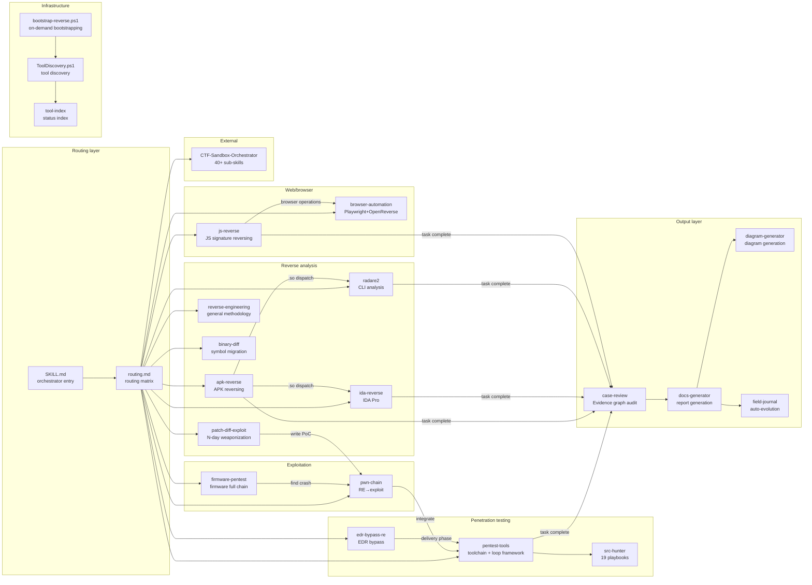
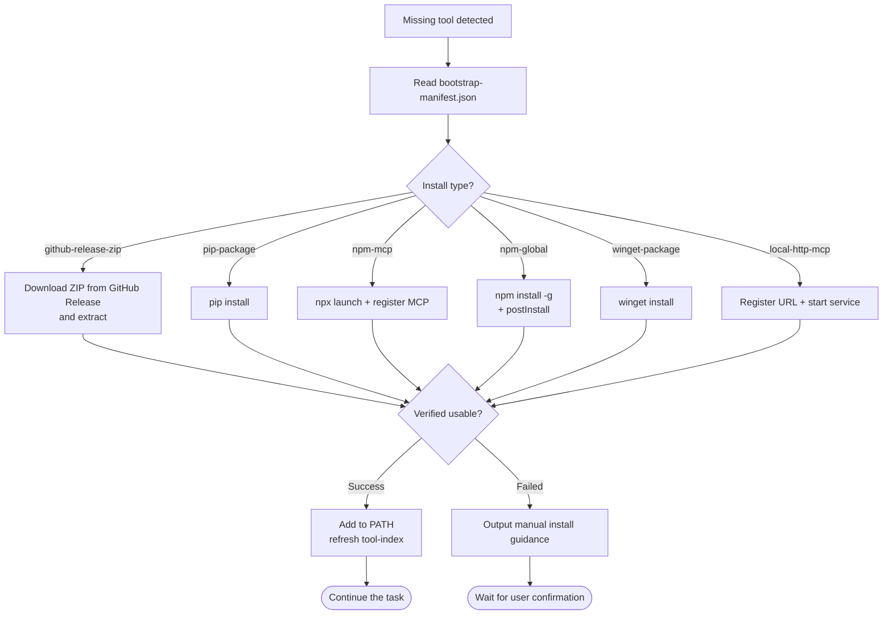
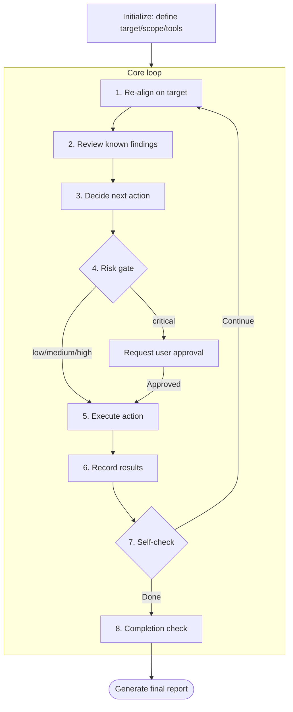
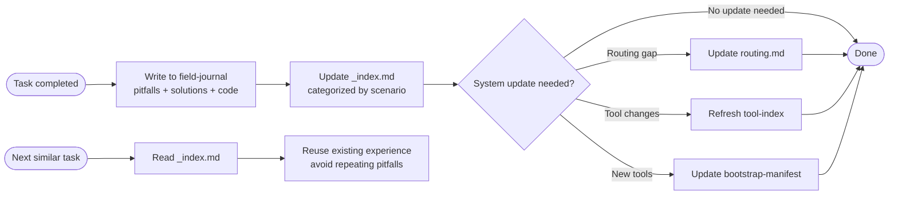
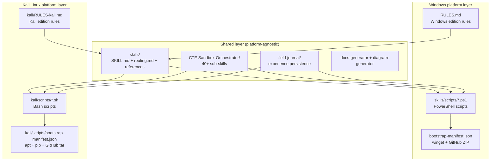
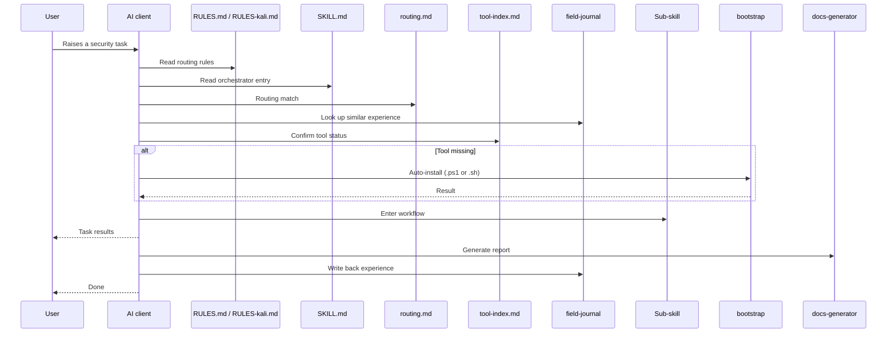

# System Architecture

## Complete Behavior Chain Flowchart

## Skill Module Relationship Diagram

## Bootstrap Bootstrapping Flow

## Penetration Testing Loop

## Auto-Evolution Mechanism

## Multi-Platform Support Architecture

### Platform Selection Logic

| Environment | Rules file used | Scripts used | Package management |
|------|--------------|-----------|--------|
| Windows | `RULES.md` | `skills/scripts/*.ps1` | winget / GitHub Release ZIP |
| Kali Linux | `kali/RULES-kali.md` | `kali/scripts/*.sh` | apt / pip / npm / GitHub tar.gz |

### Kali Edition Highlights

- **Many tools preinstalled**: nmap, sqlmap, hashcat, hydra, metasploit, radare2, binwalk, burpsuite, etc. need no bootstrap
- **Unified apt management**: no winget, no manual ZIP extraction
- **Native bash**: scripts are simpler, no PowerShell dependency
- **Clean path conventions**: `/usr/bin/`, `/opt/`, `~/tools/`, no drive letters or space issues

## File Reading Sequence Diagram

