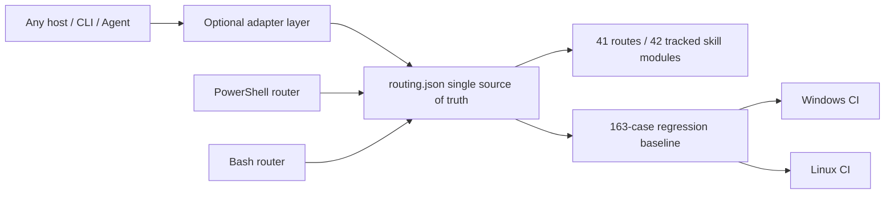

# PR #43 / #37 / #36 / #23 Local Review and Integration Report

- Date: 2026-08-08
- Baseline: `origin/main` at `6315d02`
- Review branch: `codex/review-pr-43-37-36-23`
- Scope: review only the incremental value of the four PRs relative to the current mainline; no actions against external targets
- Conclusion: all four PRs have reusable value, but only #43 and #37 merit keeping their main body; #36 and #23 must be integrated selectively

## Executive Summary

| PR | Value vs. mainline | Integration decision | Key boundaries |
|---|---|---|---|
| #43 | Very high | Keep structured routing, the 163-case current regression baseline, dual-platform CI, supply-chain pin gate, dynamic index | Drop OpenCode config, installers, and proprietary agents; the core must not bind to any client |
| #37 | High | Merge case-review, evidence-graph audit, hash verification and unit tests, plus R40 | Accept both `done` and the current convention `completed` |
| #36 | Medium-high | Selectively merge Burp reconnect/newline message handling, atomic token, Anything Analyzer auth, process tree and sudo home fixes | Reject semantic regressions such as "all capabilities ready by default" |
| #23 | Medium (low as a full package) | Merge only Bash case-init, case-guard, structured Bash routing, and CI parity | Exclude the client manifests, GIFs, demo artifacts, and hardcoded routing copies among the 92 files |

## Platform Boundaries

The single source of truth for structured routing is `skills/config/routing.json`. Both the PowerShell and Bash entry points read that file; host clients are allowed to exist only as optional adapters and must not determine the repository identity, routing rules, test baseline, or install paths.

## Review Findings and Fixes

1. The design value of #43 comes from structured data and automated gates, not from OpenCode integration. All OpenCode-specific files and CI jobs were removed.
2. The original #37 implementation only recognized `done`, which misclassified the mainline's `completed` as unfinished; compatibility plus a 7th unit test were added.
3. The bridge reconnect and token writing in #36 are net gains; its capability-status rewriting would create false positives and was not merged.
4. The #23 Bash router copied hardcoded tables verbatim, which would drift immediately from #43's R40/priority; it was rewritten to read `routing.json`, with R1/R3/R40 parity validated in CI.
5. The new supply-chain gate exposed 7 floating install sources in the Kali manifest. Frida 14.10.4, IDA MCP commit, Agent Browser 0.31.1, ProxyCat commit, Nuclei v3.8.0, and pwntools 4.15.0 were pinned, and the install commands now actually use these pins.
6. A forced post-push re-review found that the Bash `case-init` did not inherit the CaseName path constraint; paths, control characters, wildcards, and trailing dots/spaces are now rejected, with negative CI added.
7. The Bash authorized URL once incorrectly fell into `offline` and could be ready; it now aligns with PowerShell as `authorized_target_only`, making explicit that offline accepts only local samples.
8. The Bash `case-guard` now reads only from the `auth`, `network_profile`, and `signoff` sections; pseudo-fields in notes/evidence cannot pass the gate.
9. The Kali ProxyCat pinned source install now generates a probeable `~/.local/bin/proxycat` wrapper; the CI checkout was also pinned from a mutable tag to the v4.2.2 commit.
10. The original dynamic INDEX mistakenly included 12 local modules excluded by `.gitignore` on the dev machine, which would break a clean clone; the generator now enumerates only Git-tracked skills, and both clean clones and workspaces with private extensions stabilize at 42 core modules.

## Quantified Improvement over the Old Mainline

The same 163-case baseline was run against the old mainline hardcoded router and the new structured router, each in an independent PowerShell process:

| Version | Passed | Accuracy | No output |
|---|---:|---:|---:|
| Old mainline `6315d02` | 137 / 163 | 84.05% | 0 |
| Current structured implementation | 163 / 163 | 100% | 0 |

An absolute gain of 26 correctly routed cases, +15.95 percentage points. The improvement covers scenarios where the old implementation would fall back to R0: Frida/Android, certificate and root detection, packet-capture replay, ransomware, Burp/Metasploit, Go binaries, BLE, USB, native `.so`, memory dumps, etc.

## Verification Results

| Verification item | Result |
|---|---|
| Full structured-routing regression | 163 / 163 passed |
| Routing consistency and supply-chain pin gate | Passed |
| PowerShell smoke | Passed |
| P0 friction / scope-guard regression | Passed |
| Old/new 163-case A/B | 137/163 → 163/163 |
| case-review Python unit tests | 7 / 7 passed |
| Burp bridge Node regression | 1 / 1 passed |
| Bash router/case-init/case-guard parity | Passed |
| PowerShell, Bash syntax and JSON parsing | Passed |
| Java compile check | Gradle 8.7 distribution download was blocked by a local certificate-revocation network issue; switched to declared dependencies from Maven Central with JDK 21, `McpHttpServer.java` compiles |

## Residual Risks

- The Bash structured routing depends on Python 3; this is an explicit runtime dependency, but it avoids a second routing table.
- Pinned dependency versions require periodic, explicit upgrades instead of implicitly following `latest`.
- Client adapters can keep expanding, but the core data and tests must remain fully host-agnostic.
- Gradle task-layer testing was not completed locally because the 128 MB wrapper distribution download was blocked by the certificate-revocation network on a slow link; independent compilation of the modified Java sources was completed with same-version dependencies instead.

## Final Recommendation

Merge the selective results of the current review branch; do not merge the four PRs in their original full-package form. Future PRs should be split into "core routing / host adapters / demo assets / documentation" so they can be reviewed and rolled back independently.
