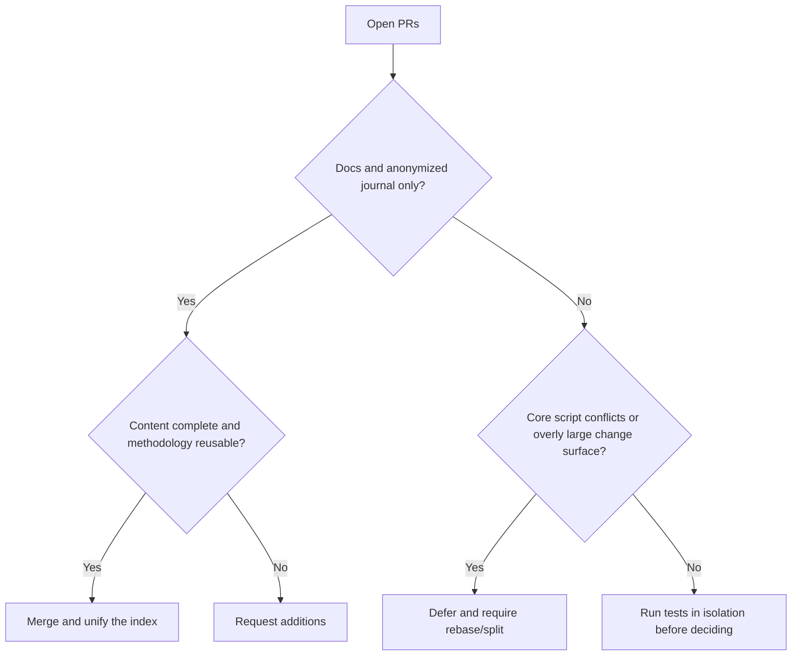

# 2026-08-08 Open PR Value Assessment and Merge Report

## Conclusion

Eight open PRs were reviewed against the latest `origin/main`. This round merges #59, #19, #22, and #29; #43, #37, #36, and #23 are deferred. Post-merge smoke and routing coherence checks all passed.

## Assessment Results

| PR | Value | Risk/Status | Decision |
|---|---|---|---|
| #59 | Complete Rust cdylib diff-reproduction methodology, highly reusable | Journal and index only, no executable code | Merge |
| #19 | Broad Windows 24H2 toolchain compatibility experience | Journal and index only | Merge |
| #22 | Complete Electron/Bytenode/update-chain analysis methodology | Journal and index only | Merge |
| #29 | Complete Next.js dual-API serializer and contract reconstruction experience | Journal and index only | Merge |
| #43 | Very high value in routing single source of truth, regression baseline, CI, and version pinning; client integration may only be an optional adapter layer | 38 files, conflicts with 4 key mainline files, the original proposal includes OpenCode-specific config | Defer; recommend a focused review after rebase; the core must not be bound to OpenCode |
| #37 | Evidence graph/case review can fill the delivery-audit gap | Conflicts with mainline routing checksum and docs | Defer; recommend rebase then run its unit tests |
| #36 | MCP/bootstrapping security hardening direction is correct | 6 key file conflicts, some capabilities already absorbed by recent mainline | Defer; deduplicate by diff |
| #23 | Bash parity and demo material have ecosystem value | 92 files, many demo assets, 2 script conflicts | Defer; recommend splitting the PR |

## Decision Diagram

## Verification

- `skills/scripts/smoke.ps1`: ALL PASS (9 script parses, 8 routing cases).
- `skills/scripts/verify-routing-coherence.ps1`: ALL ROUTING COHERENCE CHECKS PASSED.
- The user's pre-existing uncommitted journal was isolated via stash during sync and merge, then restored.

## Follow-Up Recommendations

1. Prioritize rebasing #43 onto the current `main`, with focus on JSON routing equivalence, the supply-chain pin gate, and cross-platform paths.
2. Rebase #37 separately and run `skills/case-review/tests/test_review_case.py`.
3. Compare #36 file-by-file against the already-merged security fixes and extract only the tests or edge-case handling not yet covered.
4. Split #23 into three independent PRs: Bash parity, plugin metadata, and demo assets.
