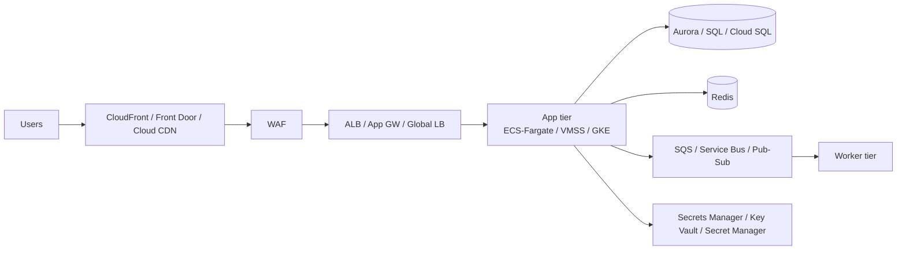

# Deliverables Reference

Every architecture task ends with these artifacts (all or the relevant subset):

## 1. Architecture diagram (Mermaid)



Rules: data flows labeled; public/private boundaries visible; multi-AZ/zone noted.

## 2. Architecture Decision Record (ADR)

```markdown
# ADR-<n>: <decision title>
- Status: proposed | accepted | superseded
- Date: YYYY-MM-DD
- Context: problem + constraints (2-4 sentences)
- Decision: what we chose
- Alternatives: what we rejected and why (1 line each)
- Consequences: positive + negative (incl. cost/ops burden)
```

One ADR per significant decision (DB engine, container platform, DR strategy, multi-region choice, IaC tool).

## 3. Security design doc

```text
□ Identity model: IAM/Entra/Cloud IAM roles, federation, MFA
□ Network: VPC/VNet design, segmentation, private endpoints, WAF rules
□ Encryption: at rest (KMS/managed keys), in transit (TLS policies)
□ Secrets: vault layout, rotation schedule
□ Compliance mapping: SOC2/HIPAA/PCI/GDPR → controls implemented
□ Threat model: top 5 threats (STRIDE quick pass) + mitigations
```

## 4. Cost estimate (see references/cost.md format)

Component table + assumptions + optimization plan + cross-provider TCO when comparing.

## 5. Deployment & rollback plan

```text
□ Environments: dev/staging/prod, promotion path
□ Strategy: blue/green or canary (per workload)
□ Rollback: previous version restore path + tested procedure
□ Migration (if lift): 6Rs choice + waves + connectivity pre-checks + cutover checklist
□ Post-deploy: health checks, smoke tests, monitoring verified
```

## 6. Operations handoff

```text
□ Monitoring: dashboards + alarm thresholds (documented)
□ Runbooks: top 5 failure modes + response steps
□ Backup/restore: schedule, retention, restore test evidence
□ On-call: escalation path
```

## Verification gate (before claiming any deliverable done)

- Diagram reflects the actual services chosen — not a generic placeholder
- ADRs record real trade-offs, not justifications after the fact
- Cost numbers: sourced or marked "directional estimate"
- IaC: plan ran clean; post-deploy checks passed
- Every claim cites evidence (doc link, resource ID, command output)
